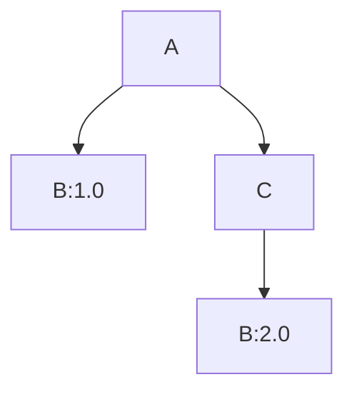
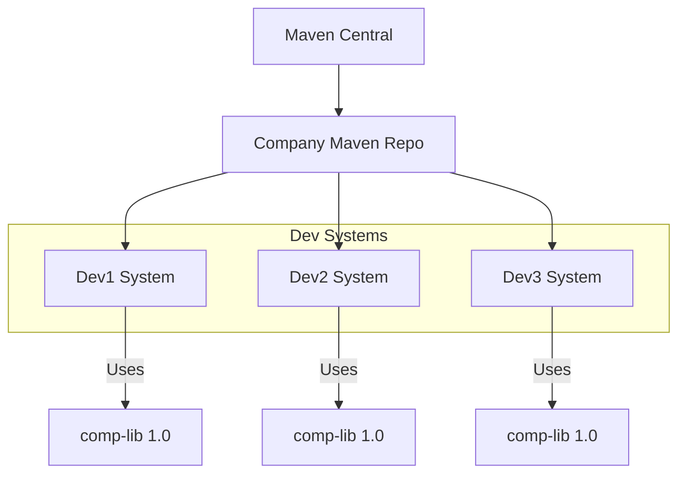
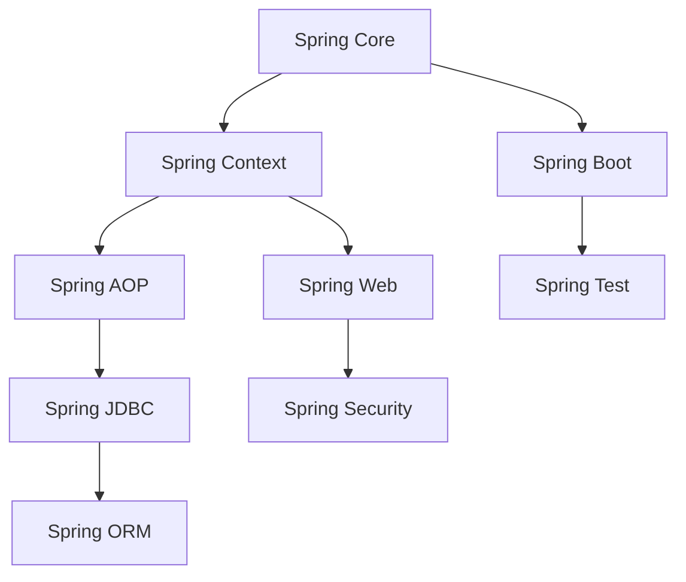

#  Maven Overview:

---

## What is Maven?

Maven is a build automation and project management tool for Java projects. It uses a declarative XML file (`pom.xml`) to manage project structure, dependencies, and lifecycle phases like compile, test, and deploy.

### Why is Maven Important?

* Automates build and dependency management.
* Supports standard directory layout and lifecycle.
* Easily integrates with CI/CD tools.

---

## Maven Archetype

An archetype in Maven is a template for generating a new project structure. It provides a standard folder structure, `pom.xml`, and sample classes or tests to jumpstart development.

**Use**:

```sh
mvn archetype:generate
```

Used to create projects with predefined templates (like quickstart, webapp, etc.)

---

## Maven Coordinates

```
<groupId>com.tekgrads</groupId>
<artifactId>firstMavenProject</artifactId>
<version>1.0-SNAPSHOT</version>
<packaging>jar</packaging>
```

* **groupId**: Unique base ID (like a package name).
* **artifactId**: Name of the project or module.
* **version**: Version of the project.
* **packaging**: Type of artifact (jar, war, pom).

---

## Dependencies in `pom.xml`

Dependencies declare external libraries your project needs.

```xml
<dependency>
    <groupId>org.apache.commons</groupId>
    <artifactId>commons-lang3</artifactId>
    <version>3.18.0</version>
</dependency>
```

---

## Maven Testing

Maven supports unit testing with frameworks like JUnit. The `maven-surefire-plugin` runs tests in the `test` phase.

---

## Declarative Dependency Management

Defined in `<dependencyManagement>` block; it allows specifying dependency versions in parent POMs for centralized control.

```xml
<dependencyManagement>
  <dependencies>
    <dependency>
      <groupId>org.junit</groupId>
      <artifactId>junit-bom</artifactId>
      <version>5.11.0</version>
      <type>pom</type>
      <scope>import</scope>
    </dependency>
  </dependencies>
</dependencyManagement>
```

---

## Black Duck

Black Duck is a tool for analyzing open-source dependencies for vulnerabilities and license risks.

### Black Duck Scam?

No direct scam, but misconfigured or unauthorized scanners can leak data or give false positives.

### Flags in Black Duck (CRT, UAT, SIT)

* **CRT**: Component Readiness Test
* **UAT**: User Acceptance Testing
* **SIT**: System Integration Testing
  Used to track security and quality status of dependencies in different environments.

---

## Transitive Dependencies

* **Direct Dependency**: Explicitly added.
* **Transitive Dependency**: Comes through another dependency.

---

## Nearest Definition and First Declaration

### Example:

```
A -> B:1.0  
A -> C:1.0  
C -> B:2.0
```

* **Nearest wins**: B:1.0 used because it’s closer.
* **First wins**: If both are at the same level, the first one declared in `pom.xml` is selected.

### Diagram:



Maven uses `B:1.0` because it's **nearest** to A.

---

## Maven Plugins in `pom.xml`

Plugins are added inside `<build>` to customize build lifecycle.

```xml
<plugin>
  <artifactId>maven-compiler-plugin</artifactId>
  <version>3.13.0</version>
</plugin>
```

---

## Maven Scope

* **compile** (default): Available everywhere.
* **test**: Only available in test compilation.
* **provided**: Needed for compilation, provided by container (e.g. servlet-api).
* **runtime**: Required for execution, not compilation.

---

## Using Properties in Versioning

```xml
<properties>
  <apache.version>3.17.0</apache.version>
</properties>

<dependency>
  <groupId>org.apache.commons</groupId>
  <artifactId>commons-lang3</artifactId>
  <version>${apache.version}</version>
</dependency>
```

---

## Maven Architecture in Enterprise



---

## Maven Commands

* `mvn clean`: Removes `target/` folder.
* `mvn compile`: Compiles the project.
* `mvn install`: Installs artifact into local repo.
* `mvn deploy`: Deploys to remote repo.
* `mvn site`: Generates documentation using plugins.

---

## JFrog Artifactory

A binary repository manager used to store and manage Maven artifacts (jars, wars) and integrate with CI/CD tools.

---

## Multi-Module Projects

### Parent `pom.xml` should contain:

```xml
<modules>
  <module>child-1</module>
  <module>child-2</module>
</modules>
```

### Child-1 `pom.xml`

(Already provided above)

### Child-2 `pom.xml`

```xml
<parent>
  <artifactId>firstMavenProject</artifactId>
  <groupId>com.tekgrads</groupId>
  <version>1.0-SNAPSHOT</version>
</parent>

<groupId>com.tekgrads</groupId>
<artifactId>child-2</artifactId>
<version>1.0-SNAPSHOT</version>

<name>child-2</name>
```

### Steps

```sh
mvn install
mvn site
```

---

## Jetty Plugin

Used to run web apps without external server.

```xml
<plugin>
  <groupId>org.eclipse.jetty</groupId>
  <artifactId>jetty-maven-plugin</artifactId>
  <version>9.4.3.v20170317</version>
  <configuration>
    <stopkey>C</stopkey>
    <stopPort>34343</stopPort>
    <httpConnector>
      <port>8080</port>
    </httpConnector>
  </configuration>
</plugin>
```

```sh
mvn jetty:run
```

---

## Spring Introduction

* **A simple CLI**: Takes input, gives output, runs on one machine, no DB.
* **Spring App Flow**:

  1. Create project and config
  2. Design classes and dependencies
  3. Write unit tests
  4. Build artifact
  5. Integrate DB with JDBC
  6. Add authentication and transaction support

---

## Spring Modules Diagram




